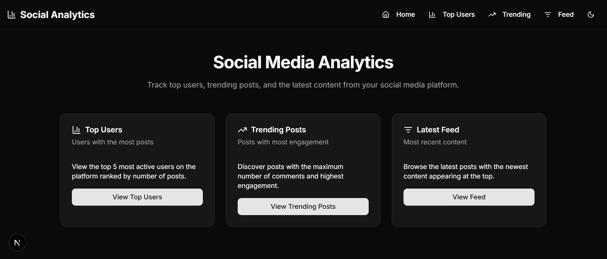
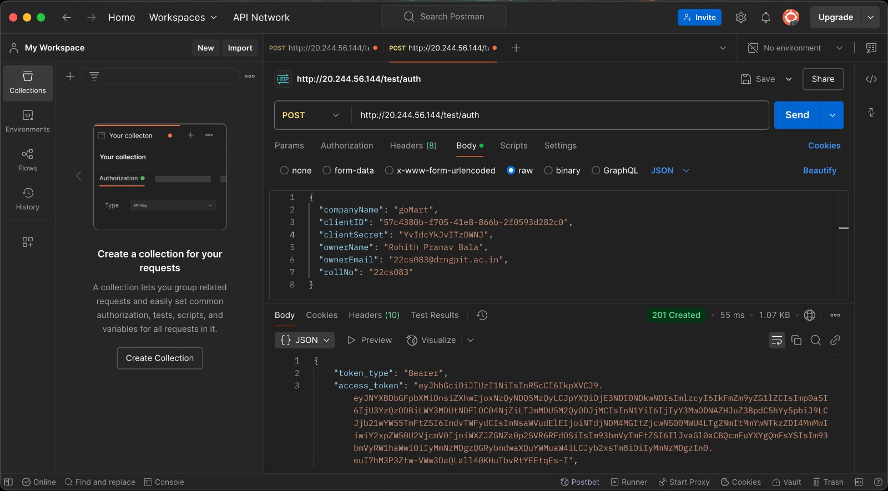

# Social Media Analytics Page

This project is a **Social Media Analytics Page** that allows users to analyze social media data.

## Tech Stack 🛠️
- **Next.js** (used dynamic routing for better navigation)
- **TypeScript** (utilized a separate utils file for type definitions and helper functions)
- **TailwindCSS**
- **ShadCN**

## Authentication & API Testing
- The test API was authorized using **Postman**.

## Project Structure 🏗️
- **Dynamic Routing**: Implemented dynamic routing in Next.js for flexible page navigation.
- **Utils File**: Used a separate `lib` folder to manage helper functions and TypeScript types efficiently.

## Screenshots 📸
### Interface

### Dark Mode Interface

### Postman API Authorization

